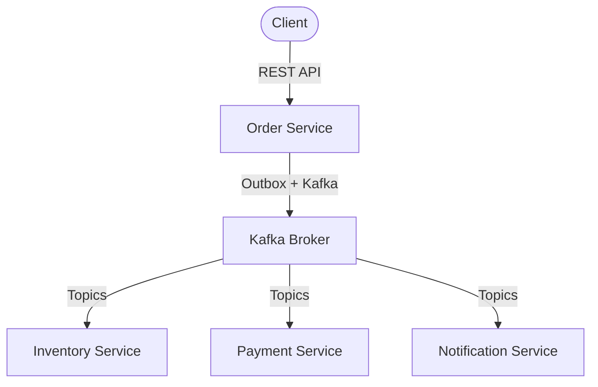
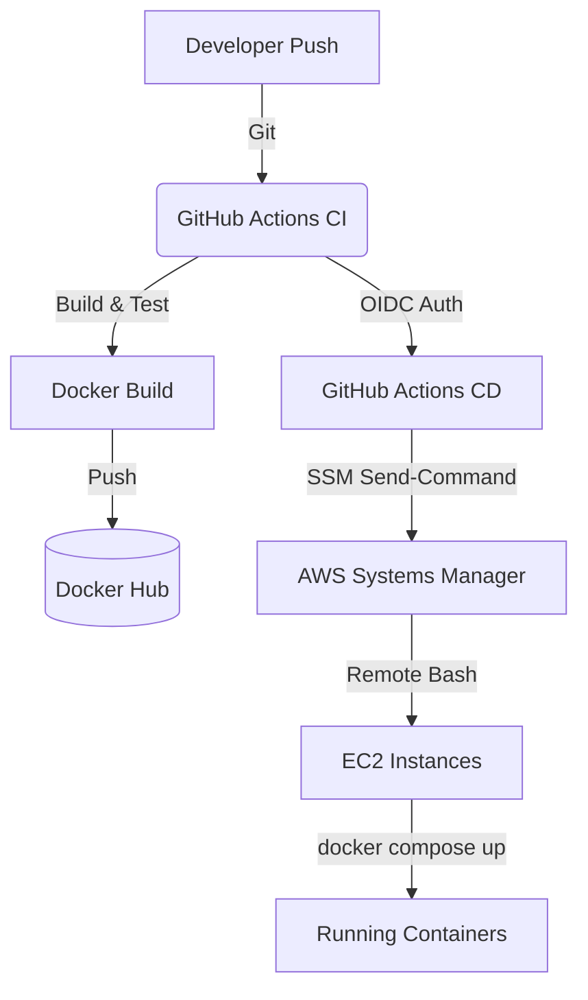
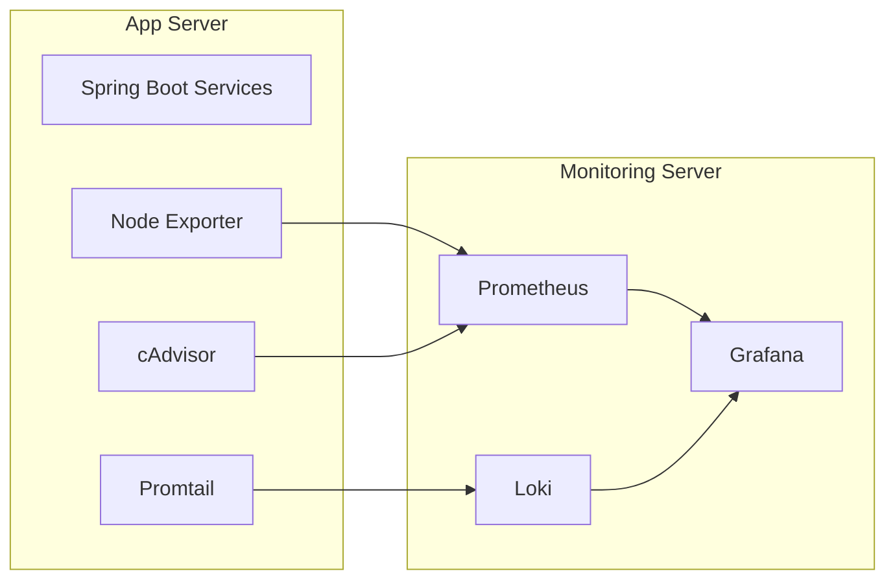
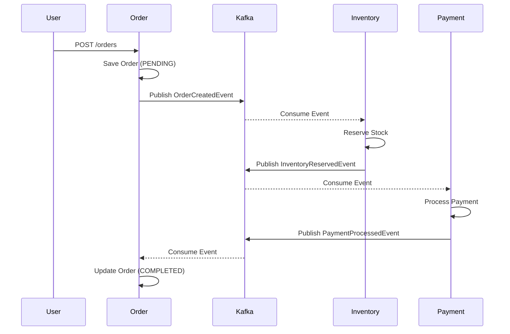

# Production-Inspired Cloud Native E-Commerce Platform

<h4 align="center">A resilient, event-driven microservices architecture deployed on AWS using Terraform, Docker, and GitHub Actions.</h4>

<p align="center">
  
  
  
  
  
  
</p>

This repository demonstrates a fully automated, production-ready backend infrastructure. It features four Spring Boot microservices communicating asynchronously via Kafka using the **Saga** and **Outbox** patterns. The focus is on robust **DevOps practices**, **Infrastructure as Code**, and **Observability**.


---

## 📑 Table of Contents
- [Project Highlights](#-project-highlights)
- [Architecture](#-architecture)
- [Infrastructure (AWS & Terraform)](#-infrastructure-aws--terraform)
- [CI/CD Pipeline](#-cicd-pipeline)
- [Monitoring & Observability](#-monitoring--observability)
- [Backend (Microservices & Kafka)](#-backend-microservices--kafka)
- [Deployment Lifecycle](#-deployment-lifecycle)
- [Testing & Resilience](#-testing--resilience)
- [Future Improvements](#-future-improvements)

---

## ✨ Project Highlights

| ☁️ DevOps & Cloud | 🛠 Backend Engineering | 📊 Monitoring & Ops |
| --- | --- | --- |
| ✅ **Terraform** (IaC) | ✅ **Microservices** (Spring Boot) | ✅ **Prometheus** (Metrics) |
| ✅ **GitHub Actions** (CI/CD) | ✅ **Kafka** (Event Streaming) | ✅ **Grafana** (Dashboards) |
| ✅ **AWS EC2 & IAM** | ✅ **Saga Pattern** (Choreography) | ✅ **Loki** (Log Aggregation) |
| ✅ **Docker Compose** | ✅ **Outbox Pattern** | ✅ **Promtail** (Log Forwarding) |
| ✅ **OIDC Auth** (No static keys) | ✅ **Circuit Breaker & Retries** | ✅ **cAdvisor / Node Exporter** |

---

## 🏛 Architecture

### High Level Architecture



### Infrastructure Layout

```mermaid
graph LR
    subgraph AWS Cloud [AWS Cloud / VPC]
        subgraph App Server [App EC2 Instance]
            OS[Order Service]
            IS[Inventory Service]
            PS[Payment Service]
            NS[Notification Service]
            K[Kafka & Kafka UI]
        end
        subgraph Monitoring Server [Monitoring EC2 Instance]
            Prom[Prometheus]
            Graf[Grafana]
            Loki[Loki]
        end
        App Server -- Metrics & Logs --> Monitoring Server
    end
```

---

## ☁️ Infrastructure (AWS & Terraform)

The infrastructure is provisioned entirely via **Terraform** (`Infrastructure/main.tf`), ensuring reproducibility and version control.

<details>
<summary><b>Click to view Infrastructure details</b></summary>

- **Two EC2 Instances (AL2023):** 
  - `Instance #1`: Runs the application stack (Microservices, Kafka, Kafka UI).
  - `Instance #2`: Runs the monitoring stack (Prometheus, Grafana, Loki).
- **IAM Roles & Least Privilege:** EC2 instances use IAM Instance Profiles to securely access CloudWatch and AWS Systems Manager (SSM) without hardcoded keys.
- **Security Groups:** Restricts access to specific ports (8081-8084 for APIs, 3000/9090/3100 for monitoring) and only allows SSH from a specific IP.
- **CloudWatch Alarms:** Automatically triggers recovery if the instance fails health checks and alerts on high CPU/Memory/Disk usage.
- **SSM Agent:** Replaces SSH for automated deployment commands from GitHub Actions.

</details>


---

## 🚀 CI/CD Pipeline

The CI/CD pipeline uses **GitHub Actions** and **AWS OIDC** to build, publish, and deploy directly to EC2 via AWS Systems Manager.



<details>
<summary><b>Click to view Deployment Internals</b></summary>

- **OIDC Authentication:** Eliminates the need for long-lived AWS IAM User credentials. GitHub Actions requests a short-lived token via AWS STS.
- **AWS SSM Send-Command:** The CD workflow sends remote bash scripts to the EC2 instances to pull the latest configuration and restart Docker Compose.
- **Zero-Downtime-ish:** The `docker compose up -d` pulls the new image and recreates containers. Healthchecks ensure services are actually up before marking the deployment as successful.

</details>


---

## 📊 Monitoring & Observability

A dedicated monitoring EC2 instance scrapes metrics and aggregates logs from the application instance.



- **Prometheus:** Scrapes JVM metrics, container stats (`cAdvisor`), and host metrics (`Node Exporter`).
- **Grafana:** Visualizes metrics with pre-provisioned dashboards via volume mounts.
- **Loki & Promtail:** Promtail tails Docker container logs and ships them to Loki for centralized search directly inside Grafana.


---

## ⚙️ Backend (Microservices & Kafka)

The application handles distributed transactions using an event-driven choreography architecture.



<details>
<summary><b>Click to view Microservice Patterns</b></summary>

- **Choreography Saga Pattern:** Services react to domain events instead of a central orchestrator commanding them. If Payment fails, a `PaymentFailedEvent` is published, triggering Inventory to release stock and Order to mark as `FAILED`.
- **Outbox Pattern:** Prevents dual-write inconsistencies. Domain events are saved to the local database in the same transaction as the business entity. A background worker polls the outbox and reliably publishes to Kafka.
- **Retries & DLT:** Messages that fail processing are retried with exponential backoff and eventually sent to a Dead Letter Topic (DLT) for manual inspection.

</details>


---

## 🔄 Deployment Lifecycle


```text
1. terraform apply -> Provisions VPC, Security Groups, IAM, EC2
2. git push -> Triggers GitHub Actions CI
3. CI -> Compiles Java, runs tests, builds Docker images, pushes to Docker Hub
4. CD -> Assumes AWS Role (OIDC), discovers EC2 IPs via AWS CLI
5. CD -> Uses AWS SSM to run `docker compose pull` & `up` on instances
6. Services start -> Healthy state verified -> Deployment Success
```

---

## 🧪 Testing & Resilience

| Scenario | Expected Behavior | Status |
| --- | --- | --- |
| **Happy Path** | Order -> Inventory -> Payment -> Notification. Order marked `COMPLETED`. | ✅ Verified |
| **Inventory Failure** | Out of stock triggers rollback. Order marked `FAILED`. | ✅ Verified |
| **Payment Failure** | Insufficient funds triggers `PaymentFailedEvent`. Inventory reverses reservation. | ✅ Verified |
| **Broker Down** | Outbox pattern keeps events in DB until Kafka recovers. | ✅ Verified |

---

## 🔮 Future Improvements

While this architecture handles production-like scenarios well, future iterations could include:

- **Kubernetes (EKS) Migration:** Replace `docker compose` with Helm charts on Amazon EKS for better orchestration and horizontal scaling.
- **OpenTelemetry / Jaeger:** Add distributed tracing to track Saga transactions seamlessly across multiple services.
- **AWS Secrets Manager:** Externalize secrets instead of relying on environment variables in GitHub Actions / Terraform.
- **Managed Databases:** Move from embedded H2 to Amazon RDS (PostgreSQL) for true data persistence.
- **Multi-Broker Kafka:** Deploy a highly available MSK cluster instead of a single KRaft node.

---

> **Note:** This project is intended as a demonstration of cloud-native architecture, CI/CD, and DevOps practices.
