# 🚀 Cloud Native E-Commerce Platform on AWS

<div align="center">


### **Production-Inspired Event-Driven Microservices Platform**

*A cloud-native e-commerce system demonstrating modern backend engineering, Infrastructure as Code, CI/CD automation, distributed transactions, centralized monitoring, and AWS deployment.*

</div>

---

# 📖 Overview

Modern distributed applications require much more than writing APIs.

They must be **deployable**, **observable**, **fault tolerant**, **scalable**, and **easy to maintain**.

This project demonstrates how a production-inspired e-commerce platform can be built using an **Event-Driven Microservices Architecture** while following modern **DevOps** and **Cloud Engineering** practices.

Instead of relying on a single monolithic application or a centralized transaction manager, every service owns its own database, communicates asynchronously using **Apache Kafka**, and maintains data consistency through the **Saga Choreography Pattern** and **Transactional Outbox Pattern**.

The project also showcases a complete deployment pipeline using **Terraform**, **GitHub Actions**, **AWS Systems Manager**, **Docker**, and a dedicated monitoring stack consisting of **Prometheus**, **Grafana**, **Loki**, **Promtail**, **Node Exporter**, and **cAdvisor**.

---

# 🎯 Project Goals

This project was built to demonstrate how modern cloud-native applications are:

- Designed using distributed microservices
- Deployed automatically using CI/CD
- Provisioned using Infrastructure as Code
- Hosted on AWS
- Containerized using Docker
- Monitored using Prometheus & Grafana
- Logged centrally using Loki
- Made resilient using Kafka retries and Circuit Breakers
- Managed without manual SSH deployments

Instead of focusing only on backend development, the repository demonstrates the complete software delivery lifecycle from development to deployment and production monitoring.

---

# ⭐ Project Highlights

## ☁ Cloud & DevOps

- Infrastructure Provisioning using **Terraform**
- AWS EC2 Infrastructure
- IAM Roles & Policies
- Security Groups
- CloudWatch Alarms
- Dockerized Deployment
- GitHub Actions CI/CD
- AWS OIDC Authentication
- AWS Systems Manager Deployments
- Zero Manual SSH Deployments
- Infrastructure Bootstrapping using User Data Scripts

---

## ⚙ Backend Engineering

- Event-Driven Microservices
- Saga Choreography Pattern
- Transactional Outbox Pattern
- Apache Kafka (KRaft Mode)
- Retry Topics
- Dead Letter Topics
- Circuit Breakers
- Spring Boot
- Spring Data JPA
- Embedded H2 Databases

---

## 📊 Monitoring & Observability

- Prometheus Metrics
- Grafana Dashboards
- Loki Centralized Logging
- Promtail Log Collection
- Node Exporter
- cAdvisor
- Docker Metrics
- JVM Metrics
- Health Checks
- Circuit Breaker Monitoring

---

# 🏗 High-Level Architecture

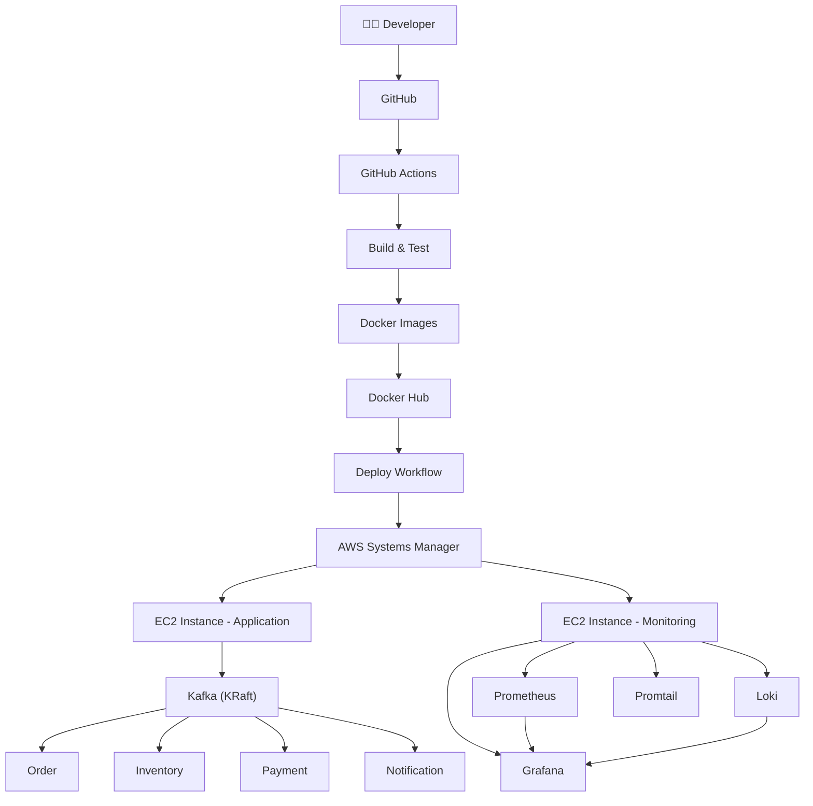

---

# 🏛 Complete System Architecture

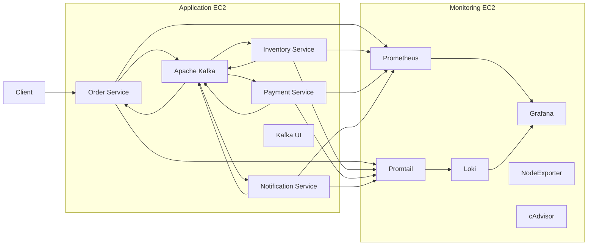

---

# 🛒 Business Workflow

The application simulates the lifecycle of an order placed on an e-commerce platform.

Instead of one service calling another synchronously, each service publishes an event that triggers the next stage of processing.

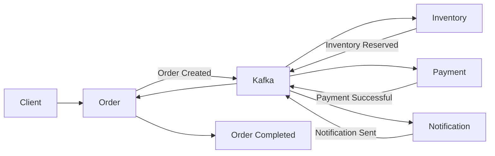

Each microservice owns:

- Its own database
- Its own business logic
- Its own Kafka producer
- Its own Kafka consumer
- Its own Outbox table
- Its own retry and dead-letter topics

This ensures complete service independence while maintaining eventual consistency across the distributed system.

---

# 🧩 Microservices

| Service | Responsibility | Database |
|----------|---------------|----------|
| **Order Service** | Creates and manages customer orders | OrderDB |
| **Inventory Service** | Reserves and releases inventory | InventoryDB |
| **Payment Service** | Simulates payment processing and refunds | PaymentDB |
| **Notification Service** | Sends order notifications | NotificationDB |

Every service is independently deployable and owns its own data.

There is **no shared database**, **no synchronous REST communication**, and **no central transaction coordinator**.

---

# 🛠 Technology Stack

## Backend

| Technology | Purpose |
|------------|---------|
| Java 21 | Application Development |
| Spring Boot | Microservices Framework |
| Spring Kafka | Kafka Integration |
| Spring Data JPA | Database Layer |
| H2 Database | Embedded Databases |
| Resilience4j | Circuit Breakers |

---

## DevOps & Cloud

| Technology | Purpose |
|------------|---------|
| AWS EC2 | Application Hosting |
| Terraform | Infrastructure as Code |
| Docker | Containerization |
| Docker Compose | Multi-container Deployment |
| GitHub Actions | CI/CD Automation |
| AWS Systems Manager | Remote Deployment |
| Docker Hub | Image Registry |

---

## Monitoring

| Technology | Purpose |
|------------|---------|
| Prometheus | Metrics Collection |
| Grafana | Visualization |
| Loki | Centralized Logs |
| Promtail | Log Collection |
| Node Exporter | Host Metrics |
| cAdvisor | Container Metrics |

---

# 📌 Repository Structure

```
.
├── .github/
│   └── workflows/
│       ├── ci.yml
│       └── deploy.yml
│
├── Infrastructure/
│
├── config/
│
├── grafana/
│
├── scripts/
│
├── docker-compose.yml
├── docker-compose.monitoring.yml
│
├── order-service/
├── inventory-service/
├── payment-service/
└── notification-service/
```

Each directory has a dedicated purpose, from provisioning cloud infrastructure to deploying application containers and configuring the observability stack.

---

# ⚙ Engineering Deep Dive

While the project showcases modern DevOps practices, its core backend architecture is designed around **Event-Driven Microservices** using the **Saga Choreography Pattern** and the **Transactional Outbox Pattern**.

Unlike traditional monolithic systems where a single database transaction guarantees consistency, distributed systems require each service to manage its own data while coordinating through events.

This project demonstrates how those challenges can be solved without introducing a central orchestrator.

---

# 🏛 Event-Driven Microservices

Each service owns:

- Its own database
- Its own business logic
- Its own Kafka producer
- Its own Kafka consumer
- Its own Outbox table

The services never communicate directly using REST APIs.

Instead, they exchange immutable events through Apache Kafka.

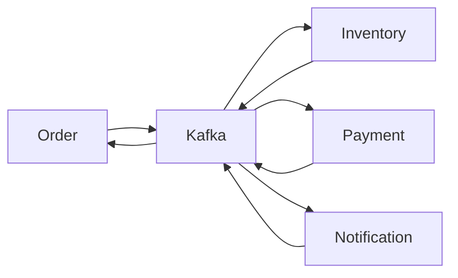

This architecture provides:

- Loose coupling
- Independent deployments
- Better fault isolation
- Horizontal scalability
- Event replay capability

---

# 🔄 Saga Choreography Pattern

Traditional distributed transactions (2PC) don't scale well in microservice environments.

Instead, this project implements a **Saga**.

A Saga is simply a sequence of local transactions connected together by events.

Each service completes its own work and publishes an event for the next service.

No central coordinator exists.

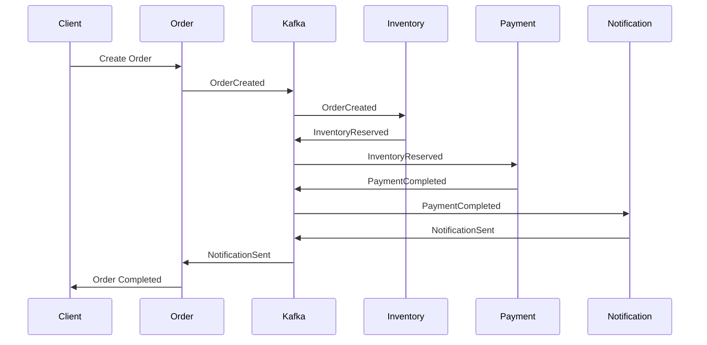

Every service only knows:

- Which event it consumes
- What business logic to execute
- Which event it should publish next

This creates a loosely coupled workflow where services remain completely independent.

---

# 🎯 Why Choreography Instead of Orchestration?

Many distributed systems use a Saga Orchestrator.

This project intentionally avoids that approach.

## Orchestrated Saga

```text
Order

↓

Saga Manager

↓

Inventory

↓

Saga Manager

↓

Payment

↓

Saga Manager

↓

Notification
```

A central service controls the entire transaction.

While easy to understand, it introduces:

- Single point of failure
- Tight coupling
- Increased complexity
- Centralized decision making

---

## Choreographed Saga (Implemented)

```text
Order

↓

Inventory

↓

Payment

↓

Notification

↓

Order
```

Every service reacts independently.

Advantages:

- No central controller
- Better scalability
- Better fault isolation
- Easier independent deployments
- More resilient architecture

---

# 📦 Transactional Outbox Pattern

Publishing an event directly after saving data introduces a dangerous problem.

Imagine this sequence:

```text
Save Order

↓

Database Commit

↓

Kafka Broker Crashes

↓

Event Never Published
```

Now:

- Order exists
- Inventory never receives it

The system becomes inconsistent.

---

## Solution

Instead of publishing immediately, every service writes an Outbox record inside the same database transaction.

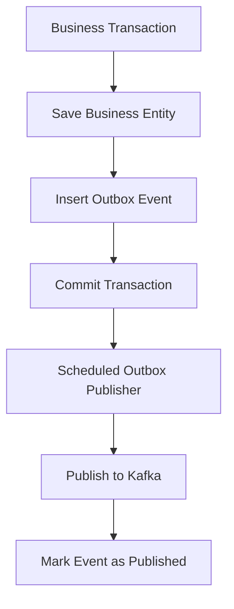

Both the business entity and Outbox row succeed or fail together.

This guarantees that no committed business transaction can ever lose its corresponding event.

---

# 🗄 Outbox Database Structure

Every service contains an Outbox table similar to:

| Column | Description |
|---------|-------------|
| id | Unique Event ID |
| aggregate_id | Business Entity ID |
| topic | Kafka Topic |
| payload | JSON Event |
| status | PENDING / PUBLISHED |
| created_at | Event Creation Time |

Example flow:

```text
Order Saved

↓

Outbox Row Created

↓

Status = PENDING

↓

Scheduled Publisher

↓

Kafka Publish

↓

Status = PUBLISHED
```

---

# ⏰ Outbox Publisher

Each service contains a scheduled publisher.

```java
@Scheduled(fixedDelay = 1500)
```

Every 1.5 seconds it:

1. Reads pending events
2. Publishes to Kafka
3. Marks successful events as PUBLISHED

```mermaid
flowchart LR

Scheduler

↓

Read Pending Rows

↓

Publish to Kafka

↓

Success?

Yes --> Mark Published

No --> Leave Pending
```

Notice that failed events are **never deleted**.

They remain pending until Kafka becomes available again.

---

# 📨 Kafka Event Lifecycle

Every event follows the same lifecycle.

```mermaid
flowchart LR

Business Event

↓

Outbox

↓

Kafka Producer

↓

Kafka Topic

↓

Kafka Consumer

↓

Business Logic

↓

Next Event
```

Example:

```text
OrderCreated

↓

InventoryReserved

↓

PaymentCompleted

↓

NotificationSent

↓

OrderCompleted
```

---

# 📚 Kafka Topics

The application uses four primary business topics.

| Topic | Producer | Consumer |
|---------|----------|----------|
| order.events | Order Service | Inventory Service |
| inventory.events | Inventory Service | Payment Service |
| payment.events | Payment Service | Notification Service |
| notification.events | Notification Service | Order Service |

Each service owns exactly one event stream.

---

# 🔁 Automatic Retry Topics

Spring Kafka automatically provisions retry topics.

For every primary topic:

```text
order.events

↓

order.events-retry-0

↓

order.events-retry-1

↓

order.events-retry-2

↓

order.events-dlt
```

The same pattern exists for:

- inventory.events
- payment.events
- notification.events

Resulting in **20 Kafka topics**.

---

# ⏳ Retry Timeline

Retries use exponential backoff.

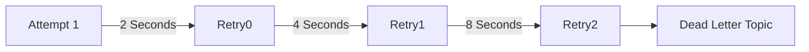

Transient failures recover automatically without manual intervention.

---

# 💀 Dead Letter Topics (DLT)

If an event still fails after all retries, it is redirected to the Dead Letter Topic.

```text
Processing Failed

↓

Retry 1

↓

Retry 2

↓

Retry 3

↓

Dead Letter Topic
```

Each service contains a dedicated `@DltHandler`.

Rather than silently discarding messages, the DLT handler publishes a **business failure event** that starts the compensation process.

---

# 🔄 Compensation Flow

Distributed systems cannot roll back multiple databases.

Instead, every service undoes its own work.

Example:

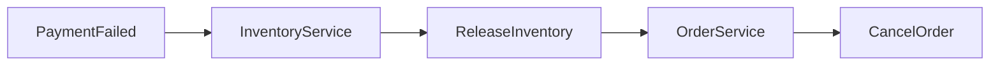

Notification failures trigger an even larger compensation chain.

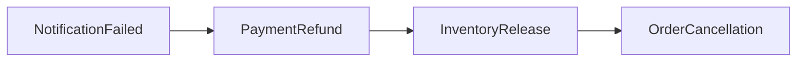

No service ever modifies another service's database.

Each service performs only its own rollback.

---

# 🗃 Database Ownership

One of the most important microservice principles is database isolation.

```text
Order Service
↓

Order Database

-----------------------

Inventory Service

↓

Inventory Database

-----------------------

Payment Service

↓

Payment Database

-----------------------

Notification Service

↓

Notification Database
```

No service is allowed to query or update another service's database directly.

Communication happens exclusively through Kafka.

---

# ⚡ Circuit Breaker (Resilience4j)

Kafka is the only external dependency that can block processing.

If Kafka becomes unavailable, publishing events could block application threads.

To prevent cascading failures, every service wraps Kafka publishing with a Resilience4j Circuit Breaker.

---

## Circuit States

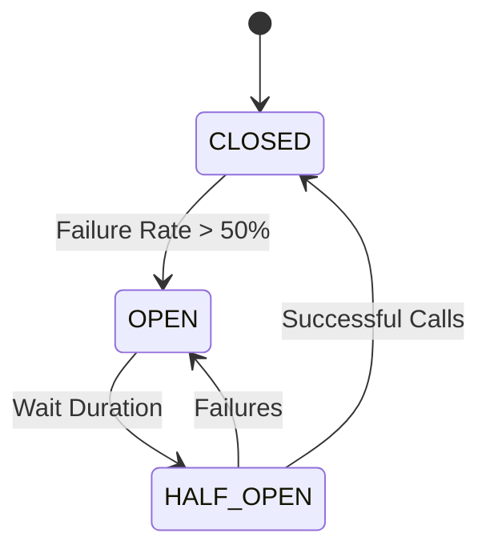

### CLOSED

Everything works normally.

Events are published immediately.

---

### OPEN

Kafka calls are rejected instantly.

No additional threads become blocked.

Outbox events remain safely stored as **PENDING**.

---

### HALF_OPEN

A few trial requests are allowed.

If Kafka responds successfully, the breaker closes automatically.

---

# 📊 Complete Event Lifecycle

```mermaid
flowchart TD

Client

↓

Order Created

↓

Order Database

↓

Outbox

↓

Kafka

↓

Inventory

↓

Inventory Database

↓

Outbox

↓

Kafka

↓

Payment

↓

Payment Database

↓

Outbox

↓

Kafka

↓

Notification

↓

Notification Database

↓

Outbox

↓

Kafka

↓

Order Completed
```

This demonstrates the complete journey of an order through the distributed system while maintaining eventual consistency.

---

# ☁ Cloud Infrastructure & DevOps

A major objective of this project was to demonstrate not only how distributed microservices are developed, but also how they are **provisioned, deployed, monitored, and maintained** using modern DevOps practices.

The infrastructure is completely automated using **Terraform**, deployments are performed through **GitHub Actions** and **AWS Systems Manager**, and the application is fully containerized with **Docker**.

The monitoring stack runs independently from the application, providing complete visibility into infrastructure health, application metrics, container performance, and centralized logging.

---

# 🏗 Production Deployment Architecture

The project is deployed across **two AWS EC2 instances**, separating the application workload from the monitoring workload.

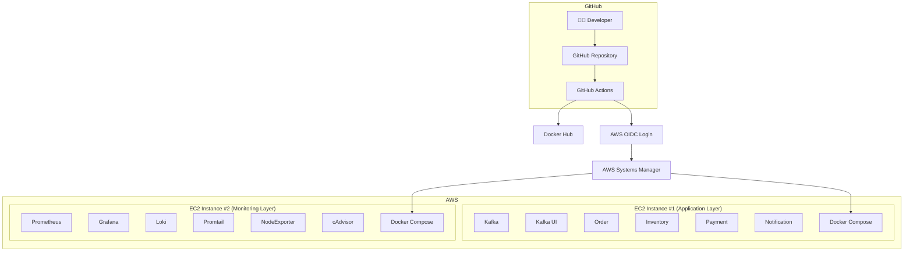

---

# 🎯 Why Two EC2 Instances?

Instead of running everything on a single machine, the application and monitoring components are isolated.

## Application Instance

Responsible for running:

- Kafka (KRaft Mode)
- Kafka UI
- Order Service
- Inventory Service
- Payment Service
- Notification Service

---

## Monitoring Instance

Responsible for running:

- Prometheus
- Grafana
- Loki
- Promtail
- Node Exporter
- cAdvisor

---

## Benefits

- Better resource isolation
- Easier troubleshooting
- Independent scaling
- Cleaner deployment architecture
- Production-inspired infrastructure

---

# 🏗 Infrastructure as Code (Terraform)

All AWS infrastructure is provisioned using **Terraform**, allowing the entire cloud environment to be recreated from code.

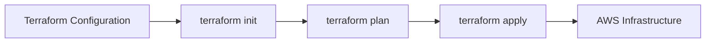

Infrastructure provisioning becomes:

- Repeatable
- Version Controlled
- Automated
- Reproducible

---

# ☁ AWS Resources Provisioned

Terraform provisions the following cloud resources.

| Resource | Purpose |
|-----------|---------|
| EC2 Instance #1 | Application Hosting |
| EC2 Instance #2 | Monitoring Stack |
| Security Groups | Network Access Control |
| IAM Roles | AWS Permissions |
| IAM Instance Profiles | EC2 Authentication |
| CloudWatch Alarms | Infrastructure Monitoring |
| User Data Scripts | Automatic EC2 Bootstrapping |

---

# 📂 Terraform Directory

```
Infrastructure/

├── main.tf
├── variables.tf
├── outputs.tf
├── user_data.sh
├── monitoring_user_data.sh
└── docker-compose.prod.yml
```

---

## main.tf

Defines all infrastructure resources including:

- EC2 Instances
- IAM Roles
- Security Groups
- CloudWatch Alarms

---

## variables.tf

Stores configurable deployment values.

Examples:

- AWS Region
- Instance Type
- SSH Whitelist
- Environment Variables

---

## outputs.tf

Prints useful deployment outputs including:

- Public IPs
- SSH Commands
- Swagger URLs
- Kafka UI URL
- Grafana URL

---

## user_data.sh

Executed automatically when the application EC2 instance launches.

Responsible for installing:

- Docker
- Docker Compose
- AWS SSM Agent
- CloudWatch Agent
- Swap Space

The instance becomes deployment-ready without any manual setup.

---

## monitoring_user_data.sh

Performs similar initialization for the monitoring instance.

Automatically installs:

- Docker
- Monitoring dependencies
- CloudWatch Agent
- SSM Agent

---

# 🐳 Containerized Deployment

Every application component runs inside Docker containers.

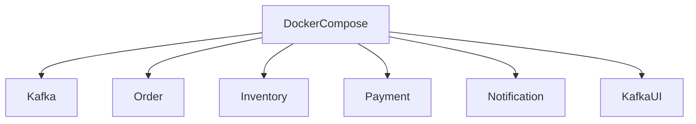

Advantages include:

- Consistent runtime
- Easy deployments
- Environment isolation
- Simplified upgrades

---

# 📦 Docker Compose

The project contains two Docker Compose files.

---

## docker-compose.yml

Responsible for running:

- Kafka
- Kafka UI
- Order Service
- Inventory Service
- Payment Service
- Notification Service

---

## docker-compose.monitoring.yml

Responsible for running:

- Prometheus
- Grafana
- Loki
- Promtail
- Node Exporter
- cAdvisor

This separation keeps application deployment independent from monitoring deployment.

---

# 🚀 CI Pipeline (GitHub Actions)

Every push to GitHub automatically triggers the Continuous Integration pipeline.

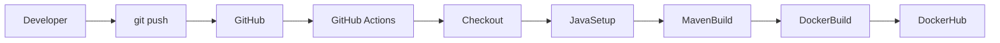

---

## CI Responsibilities

The CI pipeline performs the following automatically:

- Checkout repository
- Configure Java
- Build every Spring Boot service
- Execute Maven packaging
- Build Docker images
- Push Docker images to Docker Hub

Every successful commit produces deployable container images.

---

# 🔄 CD Pipeline (GitHub Actions)

Deployment is completely automated.

No SSH login is required.

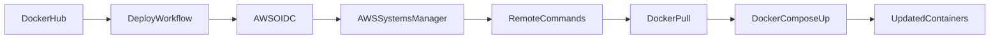

---

## Continuous Deployment Workflow

Once deployment starts:

1. Authenticate with AWS using OIDC
2. Connect to EC2 through Systems Manager
3. Pull latest Docker images
4. Restart containers
5. Verify deployment

Everything happens automatically.

---

# 🔐 Why AWS OIDC?

Traditional deployments store AWS Access Keys inside GitHub Secrets.

This project instead authenticates using **OpenID Connect (OIDC)**.

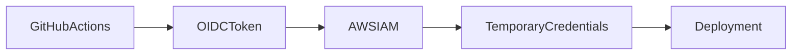

Benefits:

- No long-lived AWS credentials
- Improved security
- Temporary authentication
- Recommended AWS best practice

---

# ⚡ AWS Systems Manager (SSM)

Instead of SSHing into EC2, deployments are executed remotely using AWS Systems Manager.

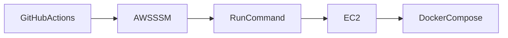

Benefits include:

- No open SSH port required
- Centralized command execution
- Secure deployments
- Fully automated updates

---

# 🌐 Networking Overview

```mermaid
flowchart TB

Internet

-->

SecurityGroup

-->

ApplicationEC2

ApplicationEC2

-->

Kafka

ApplicationEC2

-->

Microservices

MonitoringEC2

-->

Grafana

MonitoringEC2

-->

Prometheus

MonitoringEC2

-->

Loki
```

Security Groups restrict traffic while exposing only the required service ports.

---

# 📁 GitHub Workflow Directory

```
.github/

└── workflows/

    ├── ci.yml

    └── deploy.yml
```

---

## ci.yml

Responsible for:

- Building Java projects
- Creating Docker images
- Publishing images to Docker Hub

---

## deploy.yml

Responsible for:

- AWS Authentication
- Deployment Automation
- AWS Systems Manager Commands
- Updating Docker Containers

---

# 🔄 End-to-End Deployment Flow

The following diagram summarizes the complete deployment lifecycle.

```mermaid
flowchart TD

Developer["👨‍💻 Developer"]

-->

GitPush["Push Code"]

-->

GitHub

-->

GitHubActions

-->

BuildApplication

-->

BuildDockerImages

-->

PushDockerHub

-->

DeployWorkflow

-->

AWSOIDC

-->

AWSSSM

-->

ApplicationEC2

-->

DockerComposePull

-->

DockerComposeUp

-->

RunningContainers
```

From a single `git push`, the entire deployment process—from building Java applications to updating AWS infrastructure—is fully automated.

---

# 📈 Deployment Benefits

This deployment approach provides:

- Automated builds
- Automated deployments
- Infrastructure as Code
- Immutable Docker images
- Secure AWS authentication
- Zero manual deployments
- Repeatable infrastructure
- Easy rollbacks
- Consistent environments

---

# 📊 Observability & Operations

Building a distributed system is only half the challenge.

Operating that system reliably in production requires visibility into:

- Application health
- Infrastructure utilization
- Container performance
- JVM metrics
- Distributed logs
- Kafka message flow
- Service availability

To achieve this, the project includes a dedicated observability stack built around **Prometheus**, **Grafana**, **Loki**, **Promtail**, **Node Exporter**, and **cAdvisor**.

Instead of running alongside the application, the monitoring components are deployed on a dedicated EC2 instance to simulate a production-like environment.

---

# 🏗 Monitoring Architecture

```mermaid
flowchart LR

subgraph Application EC2

Order["Order Service"]

Inventory["Inventory Service"]

Payment["Payment Service"]

Notification["Notification Service"]

Kafka

Docker

end

subgraph Monitoring EC2

Prometheus

Grafana

Promtail

Loki

NodeExporter

cAdvisor

end

Order --> Prometheus
Inventory --> Prometheus
Payment --> Prometheus
Notification --> Prometheus

Docker --> cAdvisor

NodeExporter --> Prometheus

Prometheus --> Grafana

Order --> Promtail
Inventory --> Promtail
Payment --> Promtail
Notification --> Promtail

Promtail --> Loki

Loki --> Grafana
```

This separation ensures that monitoring workloads never interfere with the application itself.

---

# 📈 Monitoring Stack

The project includes a complete observability solution.

| Component | Purpose |
|------------|---------|
| Prometheus | Metrics Collection |
| Grafana | Dashboards & Visualization |
| Loki | Centralized Log Storage |
| Promtail | Log Collection Agent |
| Node Exporter | Host Metrics |
| cAdvisor | Container Metrics |

---

# 📊 Prometheus

Prometheus continuously scrapes metrics exposed by every Spring Boot microservice.

Metrics include:

- HTTP Requests
- JVM Memory
- Heap Usage
- CPU Utilization
- Garbage Collection
- Thread Count
- Response Time
- Custom Application Metrics

```mermaid
flowchart LR

SpringBoot

-->

Actuator

-->

Prometheus

-->

Grafana
```

Prometheus becomes the single source of truth for application metrics.

---

# 🌐 Prometheus Configuration

The repository includes a dedicated configuration file.

```
config/

└── prometheus.yml
```

This file defines:

- Metric scrape targets
- Scrape intervals
- Exporters
- Service endpoints

Each microservice is automatically discovered and monitored.

---

# 📉 Spring Boot Actuator

Every service exposes operational endpoints through Spring Boot Actuator.

Examples include:

```
/actuator/health

/actuator/prometheus

/actuator/info

/actuator/metrics

/actuator/circuitbreakers

/actuator/circuitbreakerevents
```

These endpoints provide real-time operational visibility.

---

# 📊 Grafana

Grafana provides a centralized dashboard for visualizing metrics collected by Prometheus and logs stored in Loki.

It becomes the operational control panel for the entire platform.

---

## Dashboard Categories

### Infrastructure Dashboard

Displays:

- CPU Usage
- Memory Usage
- Disk Utilization
- Network Throughput

---

### Container Dashboard

Displays:

- Container CPU
- Container RAM
- Network Usage
- Restart Count
- Running Containers

---

### JVM Dashboard

Displays:

- Heap Memory
- Non-Heap Memory
- Garbage Collection
- Active Threads
- HTTP Request Rates

---

### Log Dashboard

Displays:

- Live Application Logs
- Searchable Logs
- Error Logs
- Warning Logs

---

# 📊 Grafana Data Sources

```mermaid
flowchart LR

Prometheus

-->

Grafana

Loki

-->

Grafana
```

Grafana combines metrics and logs into a single interface.

---

# 📂 Grafana Repository Structure

```
grafana/

├── dashboards/

├── provisioning/

│   ├── dashboards/

│   └── datasources/
```

---

## Dashboards

The project includes pre-built dashboards for:

- Docker Containers
- System Metrics
- Log Explorer

These dashboards are automatically provisioned during startup.

No manual Grafana configuration is required.

---

# 📜 Loki

Loki is responsible for centralized log aggregation.

Instead of SSHing into servers to inspect logs, all application logs are collected automatically.

```mermaid
flowchart LR

SpringBootLogs

-->

Promtail

-->

Loki

-->

Grafana
```

---

## Why Loki?

Traditional logging often requires manually inspecting individual servers.

With Loki:

- Logs from every service are centralized
- Logs become searchable
- Historical logs are retained
- Error investigation becomes significantly easier

---

# 📦 Promtail

Promtail continuously watches Docker container logs.

Whenever a service writes to stdout, Promtail forwards those logs to Loki.

```
Docker Container

↓

stdout

↓

Promtail

↓

Loki

↓

Grafana
```

No application code changes are required.

---

# 📄 Promtail Configuration

```
config/

└── promtail-config.yml
```

This configuration specifies:

- Docker log locations
- Labels
- Loki endpoint
- Collection rules

---

# 🖥 Node Exporter

Node Exporter provides infrastructure-level metrics.

These include:

- CPU Utilization
- Memory Usage
- Disk Usage
- Load Average
- Filesystem Statistics
- Network Statistics

```mermaid
flowchart LR

EC2Host

-->

NodeExporter

-->

Prometheus

-->

Grafana
```

---

# 🐳 cAdvisor

Node Exporter monitors the host.

cAdvisor monitors Docker containers.

Metrics include:

- CPU Usage
- Memory Usage
- Container Network
- Filesystem Usage
- Running Containers

```mermaid
flowchart LR

DockerContainers

-->

cAdvisor

-->

Prometheus

-->

Grafana
```

Together, Node Exporter and cAdvisor provide complete infrastructure visibility.

---

# 📊 Complete Observability Pipeline

```mermaid
flowchart TB

subgraph Metrics

SpringBoot

NodeExporter

cAdvisor

end

SpringBoot --> Prometheus

NodeExporter --> Prometheus

cAdvisor --> Prometheus

Prometheus --> Grafana

subgraph Logs

DockerLogs

Promtail

Loki

end

DockerLogs --> Promtail

Promtail --> Loki

Loki --> Grafana
```

---

# ⚡ Monitoring Circuit Breakers

Resilience4j exposes Circuit Breaker metrics through Spring Boot Actuator.

Useful endpoints include:

```
/actuator/circuitbreakers

/actuator/circuitbreakerevents

/actuator/health
```

This allows developers to observe:

- CLOSED State
- OPEN State
- HALF_OPEN State

without inspecting application logs.

---

# 📨 Kafka Monitoring

Kafka UI provides a web interface for inspecting Kafka activity.

Features include:

- Topics
- Partitions
- Consumer Groups
- Message Browser
- Retry Topics
- Dead Letter Topics

This makes it easy to follow the lifecycle of every event.

---

# 📂 Kafka Topics

The application automatically creates:

```
order.events

inventory.events

payment.events

notification.events
```

Along with:

```
retry-0

retry-1

retry-2

Dead Letter Topics
```

Resulting in twenty Kafka topics across the platform.

---

# 🗄 H2 Database Console

Every service exposes an embedded H2 database console.

Developers can inspect:

- Business Tables
- Outbox Events
- Published Events
- Pending Events

Useful for understanding how the Outbox Pattern works internally.

---

# 🧪 Testing the Platform

The repository includes an automated integration testing script.

```
scripts/

└── test-saga.sh
```

This script demonstrates multiple scenarios.

---

## ✅ Happy Path

```text
Order

↓

Inventory Reserved

↓

Payment Completed

↓

Notification Sent

↓

Order Completed
```

---

## ❌ Inventory Failure

```text
Order

↓

Inventory Failed

↓

Order Cancelled
```

---

## ❌ Payment Failure

```text
Order

↓

Inventory Reserved

↓

Payment Failed

↓

Inventory Released

↓

Order Cancelled
```

---

## ❌ Notification Failure

```text
Order

↓

Inventory Reserved

↓

Payment Completed

↓

Notification Failed

↓

Payment Refunded

↓

Inventory Released

↓

Order Cancelled
```

---

## 🔁 Retry & Dead Letter Queue

```text
Transient Failure

↓

Retry 1

↓

Retry 2

↓

Retry 3

↓

Dead Letter Topic

↓

Compensation Flow
```

---

# 📸 Suggested Repository Screenshots

For the best GitHub presentation, include screenshots in a dedicated `assets/` directory.

```
assets/

├── architecture.png

├── deployment-pipeline.png

├── grafana-dashboard.png

├── kafka-ui.png

├── github-actions.png

├── terraform-output.png

├── docker-containers.png

├── loki-logs.png
```

---

## Recommended README Screenshot Layout

### ☁ Cloud Architecture

> *(Insert AWS deployment architecture diagram here)*

---

### 🚀 GitHub Actions

> *(Insert successful CI/CD workflow screenshot)*

---

### 📊 Grafana Dashboard

> *(Insert system metrics dashboard)*

---

### 📈 Prometheus Targets

> *(Insert Prometheus targets page)*

---

### 📨 Kafka UI

> *(Insert Kafka topics and consumer groups)*

---

### 📜 Loki Log Explorer

> *(Insert centralized logs screenshot)*

---

### 🐳 Docker Containers

> *(Insert Docker Desktop or `docker ps` screenshot)*

---

# 📈 Operational Benefits

This monitoring stack enables:

- Real-time infrastructure visibility
- Application performance monitoring
- Centralized log aggregation
- Faster incident debugging
- Kafka event inspection
- Circuit Breaker monitoring
- Historical performance analysis
- Production-inspired observability

Instead of manually checking individual servers, developers can monitor the complete distributed system from a single dashboard.

---

# 🚀 Getting Started

The project can be executed either locally using Docker Compose or deployed to AWS using the provided Infrastructure as Code and CI/CD pipeline.

---

# 📋 Prerequisites

Before running the project, ensure the following tools are installed.

| Tool | Version |
|--------|----------|
| Java | 21+ |
| Maven | 3.9+ |
| Docker | Latest |
| Docker Compose | Latest |
| Terraform | Latest |
| AWS CLI | Latest |
| Git | Latest |

---

# 📥 Clone the Repository

```bash
git clone https://github.com/<your-username>/<repository-name>.git

cd <repository-name>
```

---

# 🐳 Run Locally

Build and start the application stack.

```bash
docker compose up --build
```

The first startup may take a few minutes because:

- All Spring Boot services are built
- Docker images are created
- Kafka starts
- Topics are initialized
- Databases are created
- Monitoring services initialize

---

# 📊 Start the Monitoring Stack

```bash
docker compose -f docker-compose.monitoring.yml up -d
```

---

# 🌐 Available Services

| Service | URL |
|----------|-----|
| Order Service | http://localhost:8081 |
| Inventory Service | http://localhost:8082 |
| Payment Service | http://localhost:8083 |
| Notification Service | http://localhost:8084 |
| Kafka UI | http://localhost:8090 |
| Grafana | http://localhost:3000 |
| Prometheus | http://localhost:9090 |

---

# ☁ Deploying to AWS

The cloud infrastructure is provisioned entirely through Terraform.

## Step 1

Initialize Terraform.

```bash
cd Infrastructure

terraform init
```

---

## Step 2

Review the infrastructure plan.

```bash
terraform plan
```

---

## Step 3

Provision the infrastructure.

```bash
terraform apply
```

Terraform automatically creates:

- EC2 Application Server
- EC2 Monitoring Server
- IAM Roles
- Instance Profiles
- Security Groups
- CloudWatch Alarms
- User Data Bootstrap Scripts

---

## Step 4

Push your application code.

```bash
git add .

git commit -m "Deploy application"

git push origin main
```

---

## Step 5

GitHub Actions automatically:

- Builds the project
- Creates Docker images
- Pushes images to Docker Hub
- Authenticates with AWS
- Executes deployment through AWS Systems Manager
- Pulls the latest Docker images
- Restarts the application containers

No manual SSH login is required.

---

# 🧪 Testing the Application

The repository contains an integration testing script.

```bash
chmod +x scripts/test-saga.sh

./scripts/test-saga.sh
```

This script exercises every major application flow.

---

## Happy Path

```json
{
  "customerId":"cust-1",
  "productId":"PROD-1",
  "quantity":2,
  "amount":49.99
}
```

Expected Result

- Order Created
- Inventory Reserved
- Payment Completed
- Notification Sent
- Order Completed

---

## Inventory Failure

```json
{
  "customerId":"cust-2",
  "productId":"PROD-OUT-OF-STOCK",
  "quantity":1,
  "amount":19.99
}
```

Expected Result

- Inventory Reservation Failed
- Order Cancelled

---

## Payment Failure

```json
{
  "customerId":"cust-3",
  "productId":"PROD-1",
  "quantity":1,
  "amount":49.99,
  "simulatePaymentFailure":true
}
```

Expected Result

- Inventory Released
- Order Cancelled

---

## Retry & Dead Letter Queue

```json
{
  "customerId":"cust-4",
  "productId":"PROD-1",
  "quantity":1,
  "amount":49.99,
  "simulateTransientErrorAt":"inventory"
}
```

Expected Result

- Retry Topics Triggered
- Dead Letter Topic Populated
- Compensation Workflow Executed

---

# 📂 Repository Overview

```
.
├── .github/
│
├── Infrastructure/
│
├── config/
│
├── grafana/
│
├── scripts/
│
├── docker-compose.yml
│
├── docker-compose.monitoring.yml
│
├── order-service/
│
├── inventory-service/
│
├── payment-service/
│
└── notification-service/
```

---

# 📁 Folder Explanation

| Folder | Purpose |
|----------|---------|
| `.github/workflows` | CI/CD automation using GitHub Actions |
| `Infrastructure` | Terraform Infrastructure as Code and EC2 bootstrap scripts |
| `config` | Prometheus, Loki and Promtail configuration |
| `grafana` | Dashboards and datasource provisioning |
| `scripts` | Utility and integration testing scripts |
| `order-service` | Order lifecycle management |
| `inventory-service` | Inventory reservation service |
| `payment-service` | Payment simulation service |
| `notification-service` | Notification processing service |

---

# 🔑 Key DevOps Features

✅ Infrastructure as Code using Terraform

✅ Automated CI/CD using GitHub Actions

✅ Secure AWS authentication using OIDC

✅ Remote deployment through AWS Systems Manager

✅ Dockerized Microservices

✅ Infrastructure bootstrapping using EC2 User Data

✅ Dedicated monitoring server

✅ Prometheus metrics collection

✅ Grafana dashboards

✅ Loki centralized logging

✅ Container monitoring using cAdvisor

✅ Host monitoring using Node Exporter

✅ CloudWatch alarms

---

# 🔑 Key Backend Features

✅ Event-Driven Microservices

✅ Saga Choreography Pattern

✅ Transactional Outbox Pattern

✅ Apache Kafka (KRaft)

✅ Kafka Retry Topics

✅ Dead Letter Topics

✅ Automatic Compensation

✅ Resilience4j Circuit Breakers

✅ Eventual Consistency

---

# 📈 Skills Demonstrated

This project demonstrates practical experience across several areas of software engineering.

### Cloud Engineering

- AWS EC2
- IAM
- CloudWatch
- Systems Manager
- Infrastructure Automation

---

### DevOps

- Docker
- Docker Compose
- Terraform
- GitHub Actions
- CI/CD
- Infrastructure as Code
- Deployment Automation

---

### Backend Engineering

- Java
- Spring Boot
- Apache Kafka
- Event-Driven Architecture
- Distributed Transactions
- Saga Pattern
- Outbox Pattern
- Fault Tolerance

---

### Observability

- Prometheus
- Grafana
- Loki
- Promtail
- Node Exporter
- cAdvisor

---

# 🚀 Future Enhancements

The project is intentionally designed to be extensible. Potential improvements include:

- Migrate from H2 to PostgreSQL or MySQL
- Deploy on Amazon EKS (Kubernetes)
- Replace Docker Compose with Helm Charts
- Introduce Flyway or Liquibase for database migrations
- Implement distributed tracing with OpenTelemetry and Jaeger
- Add consumer idempotency tables for exactly-once processing
- Support horizontal scaling with multiple Kafka brokers
- Integrate AWS Secrets Manager for secret management
- Add API Gateway and Load Balancer for external traffic
- Implement Blue/Green or Canary deployment strategies

---

# 💼 Why This Project?

This repository was built to demonstrate the complete lifecycle of a modern cloud-native application—not just writing business logic, but designing, deploying, automating, monitoring, and operating distributed systems.

It combines backend engineering with DevOps practices to showcase how production-inspired systems are built using industry-standard tools and patterns. Rather than focusing solely on APIs, the project emphasizes reliability, automation, observability, and maintainability, reflecting the responsibilities of modern Cloud, DevOps, and Platform Engineers.

---

# 🙏 Acknowledgements

Special thanks to the open-source community and the maintainers of:

- Spring Boot
- Apache Kafka
- Terraform
- Docker
- Grafana Labs
- Prometheus
- Resilience4j
- GitHub Actions
- AWS

whose tools and documentation made this project possible.

---

# 📜 License

This project is intended for educational and portfolio purposes.

Feel free to fork, explore, and extend it to learn more about cloud-native architectures, event-driven systems, and DevOps workflows.

---

<div align="center">

## ⭐ If you found this project interesting, consider giving it a Star!

It helps others discover the project and supports continued development.

---

### Built with ❤️ using Spring Boot • Apache Kafka • Terraform • Docker • AWS • GitHub Actions • Prometheus • Grafana • Loki

</div>
